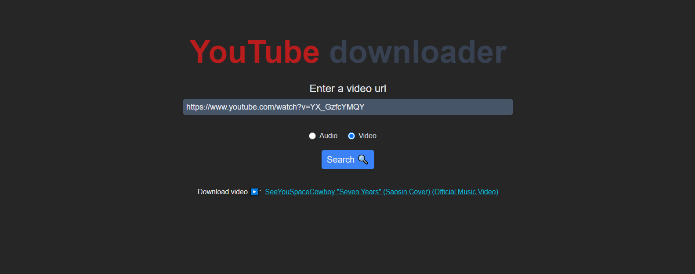
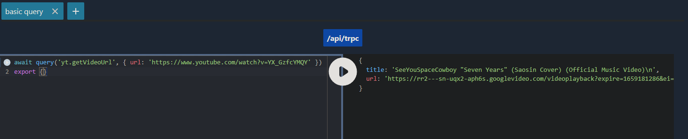

## YouTube downloader

This is an app bootstrapped according to the [init.tips](https://init.tips) stack, also known as the T3-Stack.

Download audio and video from YouTube.

### Use the [website](https://yt-api.caprover.kodokku.xyz)

  

OR

### Execute the methods through [the playground](https://yt-api.caprover.kodokku.xyz/api/trpc-playground)

- `yt.getAudioUrl`: Get the source audio url of a youtube video.
- `yt.getVideoUrl`: Get the source video url of a youtube video.
- `yt.getVideoIds`: Get the video ids of a search query.

  
